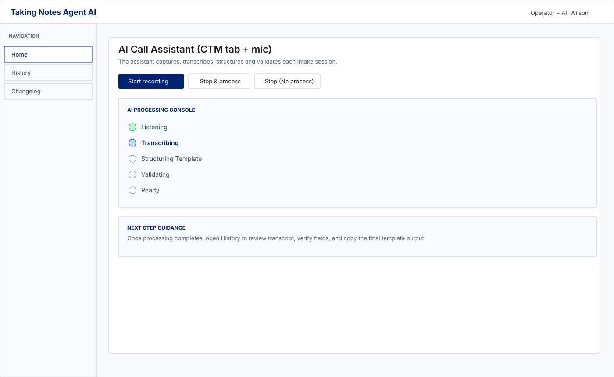
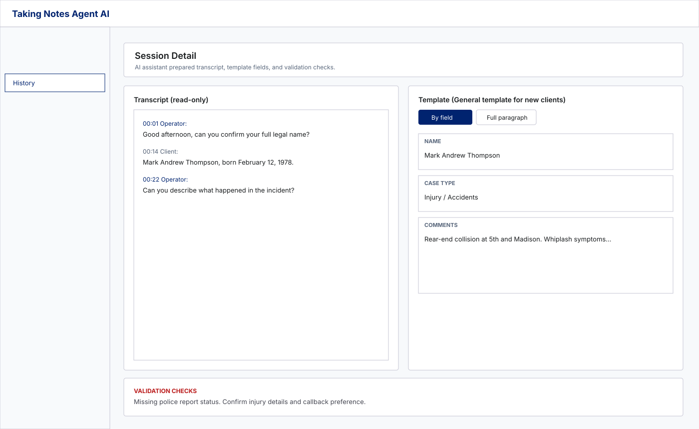
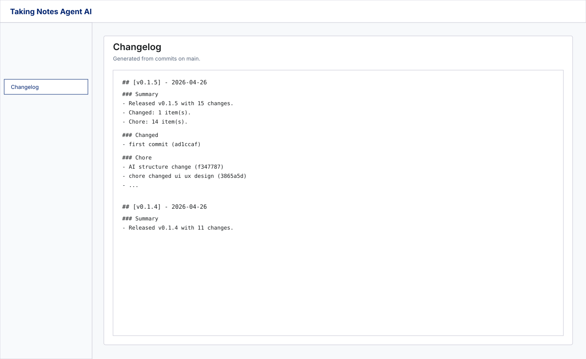

# Taking Notes Agent

Electron desktop app for **CTM-style calls**: capture **browser tab audio + microphone**, save call audio locally, transcribe with Groq (free tier, Whisper Large v3 Turbo), fill structured intake templates with Llama 3.3 70B, and review/edit sessions with a collaborative AI-style workflow.

## Current features

- AI collaborator UX in Home (processing console + guided next steps)
- Recording flow: capture source picker + mic/system audio mix (Windows)
- Auto processing after stop:
  - transcription
  - template structuring
  - validation warnings
- Session History:
  - client-first list
  - transcript + template review/edit
  - deterministic **Full paragraph** output format
- Changelog tab in-app (reads `CHANGELOG.md`)

## Visual demo

### Home - AI Processing Console



### History - Transcript + Template Workspace



### Changelog Tab



## Templates

The app currently supports **3 templates**:

- `generalNewClients`
- `lemonLaw`
- `uberRequest`

`detailedNarrative` was removed and legacy records are normalized to supported templates when loaded.

## Requirements

- Windows (primary target), Node 18+
- Chrome/Edge: when recording, share the **CTM tab** and enable **tab audio**

## Setup

```bash
npm install
```

Copy `.env.example` to `.env` in the project folder **or** put `.env` in the app userData folder (same place SQLite is created) if you prefer not to store keys next to source.

Required:

- `GROQ_API_KEY` — free key at https://console.groq.com (no card required). Add it to your actual `.env`, not just `.env.example`.

Optional (for email):

- `SMTP_HOST`, `SMTP_PORT`, `SMTP_SECURE` (`true` for 465), `SMTP_USER`, `SMTP_PASS`, `SMTP_FROM`

Note: SMTP variables are optional and currently the in-app email send action is disabled in the UI.

## Run (dev)

```bash
npm run dev
```

## Build

Compile the app (output in `out/`):

```bash
npm run build
```

Create a Windows installer under `release/`:

```bash
npm run dist
```

**Trial build (3-day read-only expiry after install):** same installer flow, but the packaged app enforces a 3-day trial (recording + AI blocked after expiry; History + email still work). Development (`npm run dev`) never enables the trial.

```bash
npm run dist:trial
```

Trial packaging uses the product name **Taking Notes Agent Demo** so it is easy to tell apart from the normal build: installer `release/Taking Notes Agent Demo Setup <version>.exe`, unpacked app `release/win-unpacked/Taking Notes Agent Demo.exe` (version comes from `package.json`).

**Windows `EPERM` unlink on `better_sqlite3.node`:** That file is locked while Electron is running (for example `npm run dev`, the Taking Notes Agent window, or another Cursor terminal that started the app). Quit the app and stop the dev server, then run `npm run dist` or `npm run dist:trial` again. Native `better-sqlite3` is rebuilt for Electron on `npm install` (`postinstall`); packaging is configured not to run a second rebuild that would delete that loaded `.node` file.

After changing the `electron` devDependency version, run `npm run rebuild:native` once before packaging.

## Data & privacy

Sessions (audio file, transcript, template JSON, profile name, timestamps) are stored under the Electron **userData** directory. Recording laws and employer/CTM policies are your responsibility; the UI includes a short notice.

## Routing

Edit `resources/routing.json` to map `templateId` → recipient emails (defaults mirror DTLA-style Zapier robot addresses from training material).

## Changelog and app versioning

Generate/update changelog and bump patch version:

```bash
node scripts/generate-changelog.mjs
```

What it does:

- updates `CHANGELOG.md` using commits from `main`
- bumps `package.json` version by patch (`x.y.z` -> `x.y.(z+1)`)
- writes newest block first using:
  - `## [vX.Y.Z] - YYYY-MM-DD`
  - `Summary`
  - categorized sections

## Scripts

- `npm run dev` — electron-vite dev (trial **off**)
- `npm run build` — compile + pack
- `npm run dist` — production installer (trial **off**)
- `npm run dist:trial` — production installer with **3-day trial** enabled
- `npm run typecheck` — TypeScript checks
